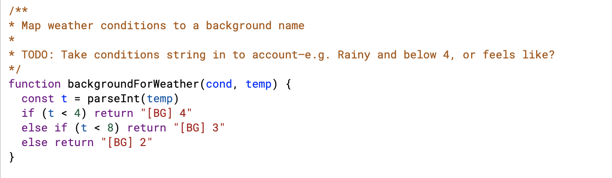
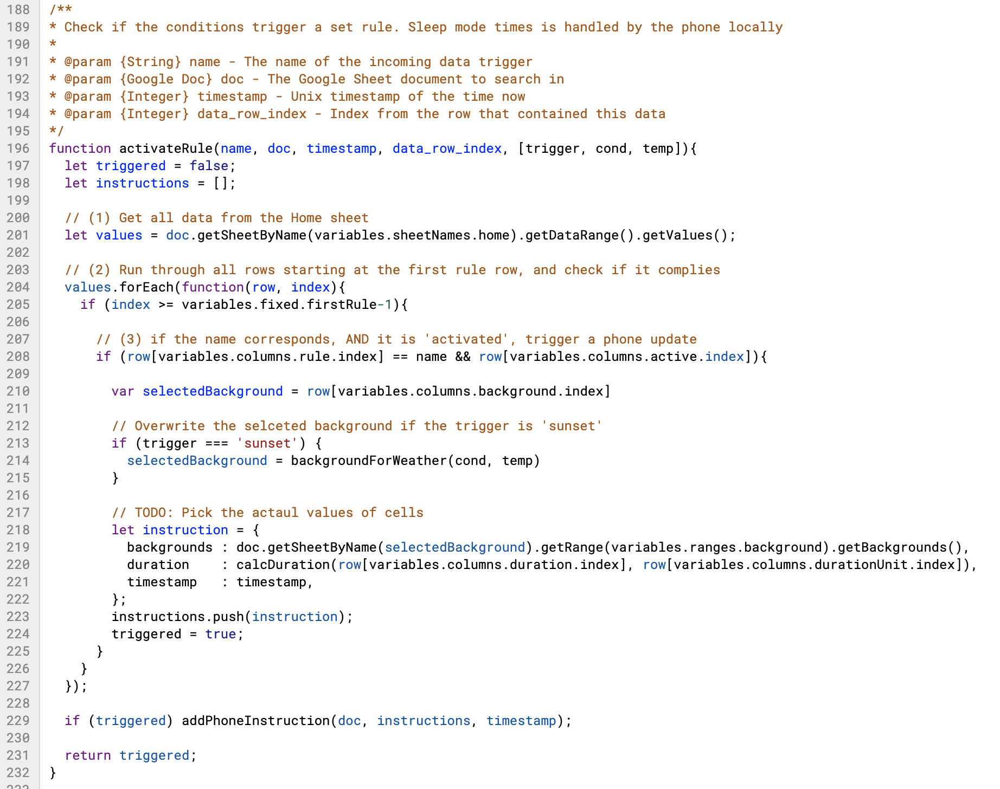

# Remixing Phone Grown during David Verweij’s Workshop at ThingsCon Good Things Fest 2020

how to use parameters?

my remix and hack :)

extending the maind code script sheet in line 195

using the “Current Conditions Changes” trigger on IFTTT from weather underground

OOPS: codnitions changed only shows the conditions, not the temperature

changing my remix:

weather on sunset.

purpose: I want to go swimming before the sunset and nee to know to dress

trigger: sunset from Weather Underground; has temp and conditions 15 minutes before sunset

I know:

- how much time would i need to know the sunset by?
  - i need ~20 minutes to walk to the swimming spot
  - i need about 5-1 to prepare
  - 3 stages
    - 4 hours to sunset
    - 1 hour to sunset
    - 30 minutes to sunset
  - Approach does not work as the info only comes in 15 minutes before sunset
- sunset trigger runs 15 minutes before the sun sets
- I would have 15 minutes to get to the swimming spot
- what would be interesting to know?
  - temp
  - conditions
  - would be great but are not available
    - wind speed
    - water temp
- Leave the phone screen on for 1.5 hours
  - that is how much time it usually takes for me to come back

change the email trigger to use the body as the conditions and subject as temp

**having a hard time to know what is going on where**

15:45
**I missed the sunset trigger!**

what i had changed

- the script
  - activateRule function to pick from the incoming parameter

and used it here:

note on usability of the system:

- takes a long time to go to the different components on different platforms
- email works as a test

notes on triggering processing

- google apps scripts have a time based trigger which can be added to the spreadsheet

todo:

- make a PR with the script changes

# future work

get a LoRaWAN module from adafruit (kiel apparently has a small network).

build a water temperature measuring unit and deploy it at the spot.

hook it up to IFTTT and the Google sheet to see the temperature as close to 0

Notes from the show and tell:

animations of different background

the phone came from the covid situation

# wrap up

i need to take a walk